<a href="https://berkeardaturk.com">
  <picture>
    <source media="(prefers-color-scheme: dark)" srcset="./assets/hero-dark.svg">
    
  </picture>
</a>

  

<a href="https://github.com/BerkeArdaTurk21/ChurnGuard"><picture><source media="(prefers-color-scheme: dark)" srcset="./assets/project-churnguard-dark.svg"></picture></a>
<a href="https://github.com/BerkeArdaTurk21/customer-churn-shap-dashboard"><picture><source media="(prefers-color-scheme: dark)" srcset="./assets/project-churn-shap-dark.svg"></picture></a>
<a href="https://github.com/BerkeArdaTurk21/EconoScope"><picture><source media="(prefers-color-scheme: dark)" srcset="./assets/project-econoscope-dark.svg"></picture></a>
<a href="https://github.com/BerkeArdaTurk21/Stock-Sentiment-Predictor"><picture><source media="(prefers-color-scheme: dark)" srcset="./assets/project-sentiment-dark.svg"></picture></a>

  

<picture>
  <source media="(prefers-color-scheme: dark)" srcset="./assets/tools-dark.svg">
  
</picture>

  

<picture>
  <source media="(prefers-color-scheme: dark)" srcset="https://github-readme-stats.vercel.app/api?username=BerkeArdaTurk21&show_icons=true&rank_icon=github&disable_animations=true&bg_color=14171d&border_color=2a2e35&title_color=ececed&icon_color=7fe0ff&text_color=9b9ea5&ring_color=7fe0ff&border_radius=16">
  
</picture>
<picture>
  <source media="(prefers-color-scheme: dark)" srcset="https://github-readme-stats.vercel.app/api/top-langs/?username=BerkeArdaTurk21&layout=compact&langs_count=6&disable_animations=true&bg_color=14171d&border_color=2a2e35&title_color=ececed&text_color=9b9ea5&border_radius=16">
  
</picture>

