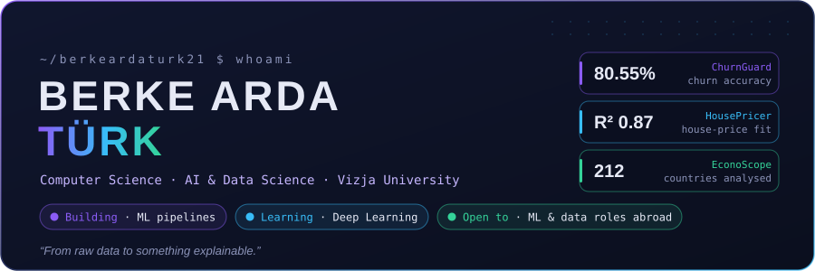
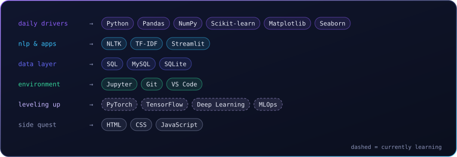

 

Computer Science student at **Vizja University** (Warsaw), specialising in **Artificial Intelligence & Data Science**.
I build end-to-end ML projects, from raw data to something explainable, across classification, regression and NLP, and I write about what I learn along the way.

- 🔬 **Now:** going deeper into deep learning, ensemble methods and model interpretability
- 🧱 **Building:** cleaner, reproducible pipelines with less notebook chaos
- 🌍 **Open to:** ML & data roles abroad, full-time or long-term internship

 

  

 

 

  

  

 

- 📝 [I Tried to Predict Customer Churn with ML — Here's What Actually Worked](https://medium.com/@berkeardaturk/i-tried-to-predict-customer-churn-with-ml-heres-what-actually-worked-50a1c38e2185)
- 📝 [I Analysed 50 Years of Global Inflation Data — Here's What I Found](https://medium.com/@berkeardaturk/i-analysed-50-years-of-global-inflation-data-heres-what-i-found-7a511fd15c73)
- → [all articles on Medium](https://medium.com/@berkeardaturk)

 

 

